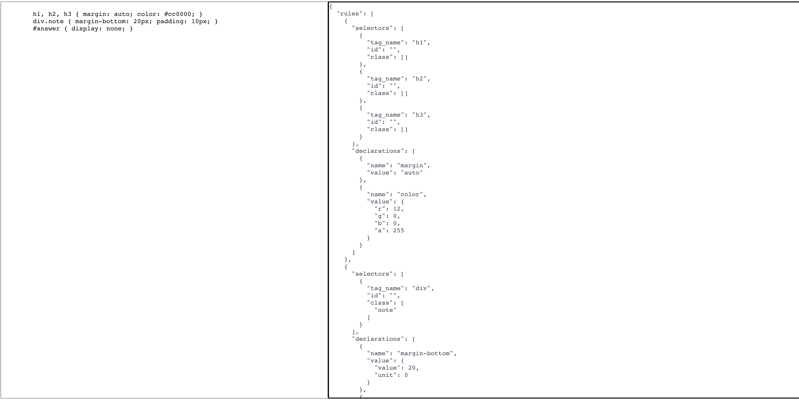

# simple-css-parser
a simple css parser by Typescript

### only 200+ lines, smallest, not complete css parser



### Getting Started
Using yarn:
```
yarn && yarn dev
```

inspired by [robinson](https://github.com/mbrubeck/robinson/)